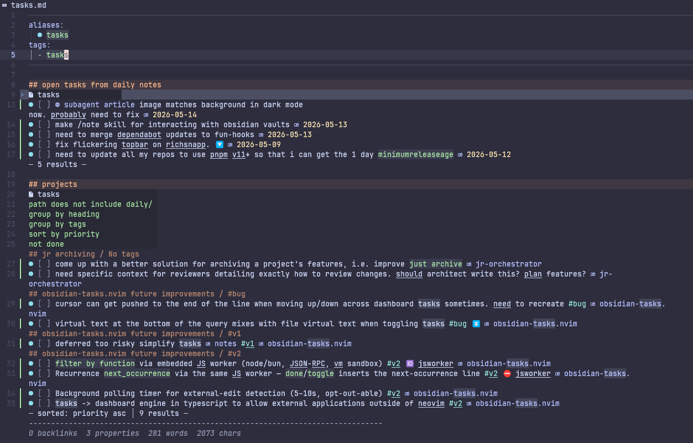

# obsidian-tasks.nvim

A Neovim port of the [obsidian-tasks](https://github.com/obsidian-tasks-group/obsidian-tasks) plugin.
Render, filter, and edit tasks across your Obsidian vault — directly in Neovim.



> **Status:** v1 in development. See [v1 Features & Limitations](#v1-features--limitations).

## Requirements

- Neovim ≥ 0.10
- [ripgrep](https://github.com/BurntSushi/ripgrep) (`rg`) on your `PATH` — used to scan the vault

That's it: obsidian-tasks has **no required Neovim-plugin dependencies**. It detects
your vault by walking up to the nearest `.obsidian/` directory and scans it with
ripgrep directly. Run `:checkhealth obsidian-tasks` to confirm your setup.

### Optional integrations

- [obsidian.nvim](https://github.com/obsidian-nvim/obsidian.nvim) — when present, its
  checkbox-symbol cycle (`Obsidian.opts.checkbox.order`) is bridged so symbols it cycles
  through are accepted as valid statuses rather than reverted.
- [blink.cmp](https://github.com/saghen/blink.cmp) — enables task-field completion (see
  [blink.cmp Registration](#blinkcmp-registration-optional)).

## Installation

### lazy.nvim

```lua
{
  "snapwich/obsidian-tasks.nvim",
  config = function()
    require("obsidian-tasks").setup({})
  end,
}
```

ripgrep is a system requirement, not a plugin — install it via your package manager
(`brew install ripgrep`, `apt install ripgrep`, …). Add `obsidian.nvim` / `blink.cmp`
to `dependencies` only if you want those optional integrations.

## Setup

Call `setup()` once during Neovim startup (e.g. inside the lazy.nvim `config` function).

```lua
require("obsidian-tasks").setup({})
```

All options are optional — the empty call above gives you sensible defaults.

### Full opts schema

````lua
require("obsidian-tasks").setup({
  -- Only parse/render tasks whose description contains this string.
  -- nil means no filter (show all tasks).
  global_filter = nil,             -- string | nil

  -- Automatically render task extmarks when a vault markdown buffer is opened.
  auto_render = true,              -- boolean

  -- Fold each ```tasks block by default when a dashboard file is opened.
  -- The foldtext shows a query summary and result count, e.g. "📋 not done  (3)".
  -- Press `i` (or `zo`) to expand a fold; press `zc` to collapse it again.
  default_folded = true,           -- boolean

  -- Install buffer-local leader keymaps (<leader>tt, <leader>te, etc.) on
  -- every markdown buffer in a vault workspace.  Set false to manage keymaps
  -- yourself.
  setup_keymaps = true,            -- boolean

  -- strftime pattern used when stamping the done date (✅) on task completion.
  done_date_format = "%Y-%m-%d",   -- string (must contain %)

  -- Timezone used when stamping the done date.
  -- "local" uses the system timezone; "utc" forces UTC (prepends "!" to the format).
  done_date_tz = "local",          -- "local" | "utc"

  -- Default file for :ObsidianTask new when no heading context is found.
  capture_file = nil,              -- string | nil  (absolute or vault-relative path)

  -- Override the default status cycle (Todo → InProgress → Done → Cancelled → OnHold).
  -- Each entry: { char = "x", name = "Done", next = "todo" }
  statuses = nil,                  -- table | nil

  -- Hide the `tasks:` / `filter:` metadata lines in rendered query blocks.
  hide_query_metadata = false,     -- boolean

  -- Keep a task visible (dimmed) after a mutation drops it from the live
  -- filter set — e.g. completing a task in a `not done` query. Cleared by
  -- :ObsidianTask refresh / <leader>tr, by buffer reload, or when the task
  -- re-enters the filter. Set false for obsidian-tasks-style instant vanish.
  linger_on_filter_exit = true,    -- boolean

  -- Highlight group applied to lingered rows (and, with dim_completed_tasks,
  -- live Done/Cancelled rows). Linked to `Comment` by default; override the
  -- link in your colorscheme or point this at a different group.
  linger_hl_group = "ObsidianTasksLinger", -- string

  -- Sink live Done / Cancelled tasks to the bottom of each group and apply
  -- linger_hl_group to them. User sort is preserved within each tier
  -- (non-completed first, completed below).
  dim_completed_tasks = true,      -- boolean

  -- blink.cmp source integration.
  blink_cmp = {
    enabled = true,                -- boolean: set false to disable the cmp source entirely
  },

  -- Natural-language date input in the cmp source.
  date_input = {
    natural_language = true,       -- boolean: enable NL parsing (e.g. "next monday")
    -- Suggestion phrases shown in the date-field dropdown.
    -- Override to shorten or localise the list.
    suggestions = {                -- string[]
      "today",
      "tomorrow",
      "next monday",
      "next week",
      "in 3 days",
    },
  },

  -- Minimum log level: "debug" | "info" | "warn" | "error"
  log_level = "info",              -- string

  -- Files larger than this (bytes) are skipped by the vault scanner.
  max_file_bytes = 1048576,        -- positive integer (default 1 MiB)

  -- DateFallback: when true, tasks in files whose basename contains a
  -- YYYY-MM-DD date inherit it as their scheduled date (only when the
  -- task has no own ⏳).  Mirrors upstream's `useFilenameAsScheduledDate`.
  use_filename_as_scheduled_date = false,  -- boolean
})
````

## Rendering

Dashboard files contain ` ```tasks ` query blocks. When a dashboard buffer is opened,
obsidian-tasks renders matching tasks as **real buffer text** below each fence and wraps
each block in a **manual fold** so the dashboard stays compact.

### Default-folded layout

With `default_folded = true` (the default), every query block opens with its fence lines
collapsed into a one-line summary; rendered task lines remain visible below:

```
📋 not done  (3)
- [ ] Task A 📅 2026-05-12 [[note-a]]
- [ ] Task B 📅 2026-05-13 [[note-b]]
- [ ] Task C 📅 2026-05-14 [[note-c]]
```

The foldtext shows a summary of the query filter and the result count. Expand the fold to
edit the underlying query:

| Key         | Action                                   |
| ----------- | ---------------------------------------- |
| `i`         | Open fold and enter insert mode on query |
| `zo` / `zO` | Open fold (stay in normal mode)          |
| `zc`        | Close fold                               |
| `zR`        | Open all folds in the buffer             |
| `zM`        | Close all folds in the buffer            |

### Editing rendered tasks in place

Rendered task lines below the fence are managed by the plugin, but you can edit
them directly — the changes propagate back to the source file:

- **Insert-mode edits.** Change a task's description or a field value while in
  insert mode; on `InsertLeave` the edit is flushed to the source file.
  Natural-language date values (e.g. `📅 next monday`) are normalized to ISO
  dates during the flush.
- **Inserting a task.** Add a new line inside a rendered region to create a new
  task; group-by attributes for the region are auto-added so the row stays in
  its group.
- **Deleting a task.** Delete a rendered row to remove the corresponding task
  line from the source file.

**Status character.** In normal mode, typing a configured status symbol over the
character between `[` and `]` commits the change to the source (same end-state as
`<leader>tt`). For example, `r x` over the space in `- [ ] task` writes
`- [x] task`. The symbol must be in your configured `statuses` set; unknown chars
revert.

Edits the plugin can't classify — normal-mode tampering with managed text, or an
unrecognized change — are **reverted** on the next event-loop tick. The rendered
region snaps back to its canonical state. You can also use the leader keymaps to
mutate a task, press `<CR>` with the cursor on the trailing `[[wikilink]]` to
follow it (handled by obsidian.nvim), or `<leader>tg` to jump to the source.

**Undo.** `u` and `<C-r>` are overridden on dashboard buffers: they walk a
per-dashboard undo/redo ring that reverses the source-file mutation (not just the
visual line). When the ring is empty they fall back to native `:undo` / `:redo`,
so prose edits still undo normally.

### Save semantics (BufWriteCmd)

Saving a dashboard buffer (`:w`) writes **only the source content** — query blocks and
prose — to disk. Rendered task lines are never written to the file. Reopening the file
produces the same visual state.

### Dim completed / linger on filter exit

Two visual options control how completed and "just-changed" tasks appear in a query:

- **`dim_completed_tasks`** (default `true`) — live Done/Cancelled tasks are sunk to the
  bottom of their group and rendered with `linger_hl_group`. Your `sort` order is
  preserved within each tier.
- **`linger_on_filter_exit`** (default `true`) — when a mutation (e.g. `<leader>tt` to
  toggle done) would cause a task to drop out of the query's filter, the row stays
  visible but dimmed instead of vanishing. Lingered rows clear on `:ObsidianTask refresh`
  / `<leader>tr`, on buffer reload, or when the task re-enters the filter.

Both effects use the `ObsidianTasksLinger` highlight group, linked to `Comment` by
default. Override with e.g.:

```lua
vim.api.nvim_set_hl(0, "ObsidianTasksLinger", { fg = "#666666", italic = true })
```

Set either option to `false` for obsidian-tasks-desktop parity (immediate vanish, no dim).

## Keymaps

All keymaps below are auto-installed when `setup_keymaps = true` (the default).
Set `setup_keymaps = false` in your `setup()` call to opt out and wire your own.

### Universal task keymaps

Installed on **every markdown buffer in a vault workspace** — both rendered
dashboard rows and raw source task lines. The handlers resolve the task under
the cursor either way (managed extmark first, then a source-line parse):

| Keymap       | Action                                              |
| ------------ | --------------------------------------------------- |
| `<leader>tt` | Toggle done/not-done                                |
| `<leader>te` | Edit task description (vim.ui.input prompt)         |
| `<leader>tp` | Cycle priority (none → highest → … → lowest → none) |
| `<leader>td` | Set/edit due date (YYYY-MM-DD prompt)               |
| `<leader>tT` | Edit tags (comma-separated prompt)                  |
| `<leader>tg` | Jump to source from anywhere on a task row          |
| `<leader>tD` | Delete task (confirm prompt, removes source line)   |

### Dashboard-only keymaps

Installed only on rendered dashboard buffers (first draw):

| Keymap       | Action                                           |
| ------------ | ------------------------------------------------ |
| `<leader>tr` | Force re-render all query regions in this buffer |
| `u`          | Undo last dashboard edit (plugin ring → native)  |
| `<C-r>`      | Redo last dashboard edit (plugin ring → native)  |

**Note on `<CR>` and `gf`:** the plugin does _not_ override these. When obsidian.nvim
is installed, its ftplugin re-registers its `smart_action` `<CR>` after each render,
racing any buffer-local handler we'd install — press `<CR>` with the cursor on the
trailing `[[wikilink]]` of a rendered task and obsidian.nvim will follow it. Either way,
`<leader>tg` jumps to the source from any column on the row. (Without obsidian.nvim,
`<CR>` / `gf` keep their native behavior.)

## Commands

| Command                      | Description                                                                 |
| ---------------------------- | --------------------------------------------------------------------------- |
| `:ObsidianTask toggle`       | Cycle the status of the task under the cursor                               |
| `:ObsidianTask done`         | Mark task done and stamp done date (honors `🏁 delete` to remove the line)  |
| `:ObsidianTask cancel`       | Mark task cancelled                                                         |
| `:ObsidianTask inProgress`   | Set status to In Progress (`[/]`)                                           |
| `:ObsidianTask onHold`       | Set status to On Hold (`[h]`)                                               |
| `:ObsidianTask due [DATE]`   | Set / edit the due date (📅)                                                |
| `:ObsidianTask scheduled`    | Set / edit the scheduled date (⏳)                                          |
| `:ObsidianTask start [DATE]` | Set / edit the start date (🛫)                                              |
| `:ObsidianTask priority`     | Cycle / set priority                                                        |
| `:ObsidianTask recurrence`   | Set the recurrence pattern (🔁)                                             |
| `:ObsidianTask tags`         | Edit the task's tags                                                        |
| `:ObsidianTask postpone [N]` | Bump primary date by N days (default +1; due > scheduled > start priority)  |
| `:ObsidianTask id [VAL]`     | Generate (or set) a 6-char base36 task id for use with `depends on` filters |
| `:ObsidianTask new`          | Create a new task (appends to `capture_file` or current file)               |
| `:ObsidianTask refresh`      | Clear and re-render all query blocks in the current buffer (clears lingers) |
| `:ObsidianTask render`       | Render query blocks in the current buffer (for `auto_render = false`)       |
| `:ObsidianTask goto`         | Jump to the source line of a rendered task                                  |

## blink.cmp Registration (optional)

obsidian-tasks ships an optional [blink.cmp](https://github.com/saghen/blink.cmp) source that
provides field-icon completions, per-field value suggestions (dates, recurrence patterns, …),
and natural-language date parsing on every task line. It is only active if you install
blink.cmp and register the source; the plugin never requires it.

Register the source in your blink.cmp config:

```lua
require("blink.cmp").setup({
  sources = {
    default = { "lsp", "path", "snippets", "buffer", "obsidian-tasks" },
    providers = {
      ["obsidian-tasks"] = {
        module = "obsidian-tasks.cmp.source",
        name = "ObsidianTasks",
      },
    },
  },
})
```

The source activates automatically on task lines (`- [ ] …`) inside any Obsidian vault
(a folder containing a `.obsidian/` directory). No additional configuration is required
beyond `require("obsidian-tasks").setup({})`.

To disable the source without removing it from blink, set `blink_cmp = { enabled = false }` in
your `setup()` call.

## v1 Features & Limitations

**What works in v1:**

- Emoji-field and Dataview-field task parsing and serialization
- Real-text task rendering in dashboard buffers with manual fold per query block
- BufWriteCmd save handler — only source content (queries + prose) written to disk
- In-memory vault index (in-Neovim edits propagate on save; external edits re-indexed automatically when Neovim regains focus, or on demand via `:ObsidianTask refresh`)
- **Query syntax portable with upstream obsidian-tasks**: bare-infix AND/OR/NOT, case-insensitive operators, optional parens (`A AND B AND C` and `(A) AND (B)` both work). `path` / `folder` / `root` match against the **vault-relative** path (e.g. `daily/2024-03-15.md`, not the absolute filesystem path) so query results match Obsidian's behaviour when the same vault is opened in both
- Query filters by field: `done` / `not done`, `status.name`, `status.type`, `priority is/above/below`, date filters with `before` / `after` / `on` / `on or before` / `on or after` / `in` (+ two-date ranges and year / month / ISO-week / quarter period shortcuts), `tag includes/does not include`, `path` / `folder` / `root` / `filename` / `backlink` / `description` / `heading` (with regex), `is recurring`, `recurrence includes`, `urgency above/below`, `exclude sub-items`, `random`
- **Dependency filters**: `id is <X>`, `depends on <X>`, `is blocking`, `is blocked` (with their negated forms)
- `sort by` and `group by` for all the above keys, including `random`
- `limit N` (per group + total cap), `hide <subkey>` for 14 metadata subkeys
- `explain` keyword renders the parsed query summary in the result
- **Urgency**: full upstream-parity formula across due / scheduled / start / priority
- Status cycling with customizable statuses; `done` filter aligned with upstream (CANCELLED counts as done)
- OnCompletion 🏁: `🏁 delete` removes the line when the task is marked done/toggled to a completed status
- DateFallback: opt-in (`use_filename_as_scheduled_date`) inheritance of `YYYY-MM-DD` filenames as the task's scheduled date
- Dim completed tasks and linger rows that drop out of the filter after a mutation
- Leader keymaps for task mutation on any task line — dashboard rows and raw source files
- Edit-in-place: insert-mode description/field edits, task inserts, and deletes flush to source on `InsertLeave`; per-dashboard undo/redo ring
- blink.cmp source: field-icon completion, value suggestions, NL date parsing (with number-word forms: `in two weeks`)
- `:ObsidianTask` command suite (toggle / done / cancel / inProgress / onHold / due / scheduled / start / priority / recurrence / tags / **postpone [N]** / **id** / refresh / render / new / goto)

**v1 limitations:**

- **Recurrence (🔁):** parsed and preserved as opaque text; `next_occurrence` computation
  is a v2 feature and raises an error if called directly.
- **Language:** English-only NL date phrases.
- **External vault edits:** re-indexed automatically when Neovim regains focus, but only for
  files already in the index — files created externally while Neovim is running are not
  picked up until opened or until a full `:ObsidianTask refresh`.
- **JS expression filters (`where filter by function`)** are intentionally not supported —
  the line emits a structured `unsupported` error in the result.
